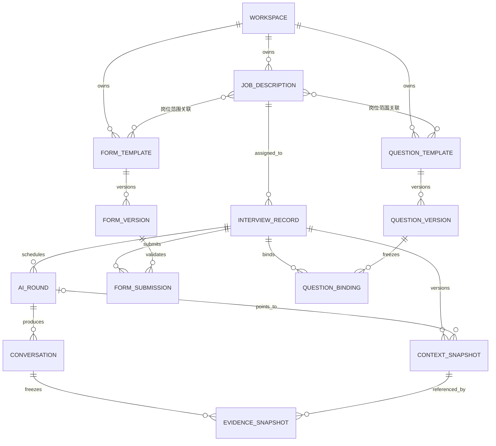

# AI 招聘系统领域关系与关键流程

> 本文描述当前代码中的实际数据关系和主要业务流程，重点解释表单题、沟通题、AI 面试轮次、快照，以及岗位人才推荐的范围。文中的“候选人记录”指 `studio_interview`，它是一条招聘流程记录，不等同于某一轮面试。

## 1. 名词对照

| 产品名称       | 代码 / 领域名称                                 | 含义                                                                                             |
| -------------- | ----------------------------------------------- | ------------------------------------------------------------------------------------------------ |
| 表单题         | Candidate Form                                  | 候选人在开始 AI 面试前填写的结构化表单，可包含单选、多选和文本题。                               |
| 沟通题         | Interview Question Template / Question Template | AI 面试官在面试中需要覆盖的问题模板，可配置难度、考察重点和追问方向。                            |
| 个性化问题     | Personalized Questions                          | 根据当前候选人的简历生成并保存在候选人记录上的问题，不属于沟通题模板。                           |
| 候选人记录     | Interview Record / `studio_interview`           | 一名候选人在当前招聘流程中的主记录，关联岗位、简历、阶段、表单提交和多个面试轮次。               |
| AI 面试轮次    | Schedule Entry / `studio_interview_schedule`    | 候选人的一次 AI 面试安排，例如“一面”“第二轮”。                                                   |
| 运行上下文快照 | Interview Context Snapshot                      | 面试运行时读取的冻结配置，包括候选人、岗位、面试官、全局话术、表单版本、沟通题版本和个性化问题。 |
| 证据快照       | Interview Evidence Snapshot                     | 面试结束后用于报告和复核的证据集合，包括运行上下文、表单提交、逐字稿和录制信息。                 |

## 2. 核心关系



需要特别注意：

- 候选人记录和 AI 面试轮次是一对多关系。一名候选人可以有多轮 AI 面试。
- 表单提交和沟通题绑定当前都挂在候选人记录上，不直接挂在某一轮上。
- 证据快照同时关联候选人、轮次和会话，因此面试后的逐字稿与报告证据是轮次可追溯的。
- 运行上下文快照虽然带有可选的轮次 ID，但当前读取方式是“按候选人取最新 active 快照”。它在实现上是候选人级的版本链，不是每轮完全独立的一条配置链。

## 3. 表单题

### 3.1 适用范围

每个表单模板只能选择一种范围：

- `global`：工作区全局表单，适用于所有岗位；不能再绑定具体岗位。
- `job_description`：岗位表单，至少绑定一个岗位，可同时绑定多个岗位。

创建面试上下文快照时，系统会合并：

1. 当前工作区所有未归档的全局表单；
2. 当前岗位关联的所有未归档岗位表单。

岗位表单排在全局表单之前，同类表单按创建时间排序。

### 3.2 版本与提交

- 模板内容会生成不可变版本，版本中保存标题、说明、适用范围、岗位关联和完整题目。
- 运行上下文快照记录表单的 `templateId`、`versionId`、版本号和完整模板快照。
- 候选人提交时按照该版本校验必填项、选项和题目 ID，不能提交模板中不存在的题目或选项。
- 同一候选人记录对同一个表单模板只能提交一次。
- 表单提交属于候选人记录，因此当前多轮 AI 面试默认复用已经提交的表单，不要求每轮重新填写。
- 开始面试前，候选人必须完成当前 active 上下文快照中的全部表单，否则接口返回 `forms_required`。

### 3.3 模板更新后的刷新边界

编辑模板不会直接修改已冻结的旧版本。批量“刷新未填写候选人表单题”只更新同时满足以下条件的候选人：

- 候选人未结案；
- 已存在 active 运行上下文快照；
- 所有 AI 面试轮次仍为 `pending`，即从未开始；
- 尚未提交该表单；
- 该表单仍在候选人当前岗位的适用范围内。

已提交表单或已经开始面试的候选人不会被批量刷新，以免改变已经确认或已经用于面试的内容。

## 4. 沟通题

### 4.1 适用范围和题目内容

沟通题模板同样分为：

- `global`：适用于工作区中的所有候选人；
- `job_description`：适用于所关联岗位的候选人。

每道沟通题可以配置：

- 题目内容；
- 难度：简单、中等或困难；
- 考察重点；
- 追问方向；
- 排序。

### 4.2 绑定关系

系统创建或启动 AI 面试时，会为候选人自动绑定当时适用的沟通题模板版本。绑定记录保存：

- 模板和具体版本；
- 在面试中的排序；
- 是否被招聘人员手动停用。

绑定属于候选人记录。运行时只展开未被停用的模板，再按模板顺序和题目顺序生成 AI 面试的必问题目。

沟通题和个性化问题是两条来源：

- 沟通题用于统一岗位考察标准；
- 个性化问题来自候选人简历，用于针对个人经历追问；
- 开始面试时两类问题至少有一类非空，否则接口返回 `questions_required`。

### 4.3 模板更新后的刷新边界

批量“刷新未面试候选人沟通题”会查找已绑定该模板或仍处于模板适用范围内的候选人，并仅刷新：

- 未结案的候选人；
- 所有 AI 面试轮次仍为 `pending` 的候选人。

刷新会把绑定切换到模板最新版本，并重建 active 运行上下文快照。已经开始过任意一轮 AI 面试的候选人不会被批量改写。

需要注意：一次 `manual_refresh` 会重新解析该候选人的全部沟通题绑定和全部表单版本，不只刷新触发操作的单个模板。

## 5. 面试轮次与两层快照

### 5.1 运行上下文快照

运行上下文快照在创建或启动 AI 面试时生成，主要冻结：

- 候选人基本信息、简历画像和目标岗位；
- 岗位名称、描述和岗位 Prompt；
- AI 面试官的人设、Prompt 和声音；
- 公司背景、开场话术和结束话术；
- 表单题的具体版本；
- 沟通题的绑定、启停状态和具体版本；
- 个性化问题；
- 当前关联的轮次 ID。

快照按候选人递增版本，状态为 `active` 或 `superseded`。刷新时旧 active 快照会被标记为 `superseded`，再创建新的 active 版本；旧版本不会被原地覆盖。

创建原因包括：

- `create`：创建或启动 AI 面试时首次冻结；
- `manual_refresh`：人工或模板批量刷新；
- `reset`：重置轮次时按当前配置重新冻结。

当前实现的一个边界是：候选人页面开始某一轮时，服务端按候选人 ID 读取 active 快照，而不是按轮次 ID 读取专属快照。因此多轮面试通常共享候选人的最新 active 配置；如果在轮次之间刷新或重置，后续读取会使用新的 active 版本。证据快照会记录实际使用的上下文快照 ID，以保留追溯关系。

### 5.2 证据快照

AI Agent 上报面试结果后，系统创建证据快照，内容包括：

- 实际使用的运行上下文及其快照 ID；
- 本次会话 ID 和轮次 ID；
- 候选人的表单答案及其表单版本；
- 面试逐字稿；
- 录制状态、文件和时长；
- 证据生成时间。

摘要和评价任务从证据快照读取表单回答、问题和逐字稿，避免报告生成时误读后来被修改的岗位、模板或候选人信息。

### 5.3 轮次状态与重连

AI 面试轮次状态为：

```text
pending -> in_progress -> interrupted -> in_progress -> completed
```

- 首次开始时，系统为该轮生成并保存 LiveKit 房间名和候选人身份。
- 候选人异常断连后进入 `interrupted`，3 分钟内可使用同一房间和身份继续。
- 超过重连宽限期，轮次会结束。
- Agent 上报报告时只完成匹配的轮次，不自动推进或结案整个候选人招聘流程。
- 重置轮次会清空旧会话锚点、把轮次恢复为 `pending`，并基于当前岗位和模板创建新的运行上下文快照；旧会话及其证据仍可保留用于审计。

## 6. 岗位人才推荐的推荐范围

### 6.1 权限和数据范围

打开岗位人才推荐需要同时具备以下读取权限：

- 岗位读取；
- 候选人管理读取；
- 简历池读取。

推荐只在当前工作区内检索，当前包含两个来源：

| 来源       | 纳入条件                                                              |
| ---------- | --------------------------------------------------------------------- |
| 候选人管理 | 当前工作区、候选人未结案，并且语义向量被检索命中。                    |
| 简历池     | 当前工作区、`scope=public`、状态为 `active`，并且语义向量被检索命中。 |

当前明确不包含：

- 其他工作区的数据；
- 私有简历池中的候选人；
- 已结案的候选人管理记录；
- 已停用的简历池记录；
- 未建立语义索引或没有进入向量检索候选集的简历。

岗位本身按当前用户的可见范围读取；候选来源加载当前只按工作区过滤，没有继续按招聘组或招聘单元做二次可见范围裁剪。如果业务要求岗位推荐也严格继承更细粒度的候选人可见范围，需要单独收口这部分权限。

### 6.2 排序、阈值和数量

推荐使用岗位名称、岗位描述和岗位 Prompt 生成语义查询，并与简历的三个维度比较：

| 维度           | 权重 |
| -------------- | ---: |
| 技能与角色     |  45% |
| 工作与项目经历 |  35% |
| 简历整体画像   |  20% |

最终分数为三个相似度的加权结果乘以 100 后向下取整。当前规则为：

- 只展示推荐分 `>= 55` 的候选人；
- 按推荐分从高到低排序；
- 在招岗位页面默认最多显示 20 人；
- 后端接口允许请求 1～50 人；
- 页面默认排除已经关联当前岗位的候选人；接口可通过参数关闭该排除规则；
- 页面缓存推荐结果 60 秒。

向量检索会分别为整体画像、技能角色、工作项目拉取最多 40、50、50 个初始命中，再合并、过滤和排序。这些数字是检索候选池上限，不是最终一定返回的人数。

推荐理由的生成阈值为：

- 技能与角色相似度 `>= 0.78`：技能与岗位要求相似；
- 工作与项目相似度 `>= 0.75`：项目或职责经验匹配；
- 整体画像相似度 `>= 0.72`：候选人整体画像匹配；
- 岗位文本直接命中候选人技能时，最多列出 3 个命中技能；
- 每名候选人最多展示 4 条推荐理由。

人才推荐目前只提供排序、理由和简历查看，不会自动把候选人绑定到岗位、启动面试或推进招聘阶段。语义 embedding 或 Qdrant 未配置时，功能返回“语义推荐未启用”。

## 7. 主要业务流程

### 7.1 岗位与面试资源配置

1. 创建岗位，填写岗位描述和岗位 Prompt。
2. 为岗位配置 AI 面试开关和至少一名 AI 面试官。
3. 按需要把岗位关联到岗位范围的表单题和沟通题。
4. 工作区全局表单题、全局沟通题和全局面试话术自动对适用候选人生效。
5. 岗位修改后会重新进入语义索引队列，供人才推荐使用。

### 7.2 简历进入系统

1. 简历可从直接上传、简历池、聊天、邮件或 API 等入口进入。
2. 系统解析简历，保存结构化画像、技能和简历文本。
3. 完成语义索引后，简历才可能出现在岗位人才推荐中。
4. 候选人管理中的记录绑定岗位后，后续表单题、沟通题、面试官和岗位 Prompt 都以该岗位为配置入口。

### 7.3 创建并开始 AI 面试

1. 启动前检查候选人未结案、招聘阶段允许、简历已就绪、岗位未关闭 AI 面试且已配置 AI 面试官。
2. 创建一条或多条 AI 面试轮次，并把候选人阶段推进到 AI 面试阶段。
3. 自动绑定适用沟通题版本，生成运行上下文快照。
4. 候选人打开面试页，读取快照中的表单并提交。
5. 开始面试时再次校验表单已完成、沟通题或个性化问题至少存在一项。
6. 系统创建 LiveKit 会话，把快照中的面试配置交给 Voice Agent。
7. Agent 按必问题目执行面试，并在结束或超时后上报逐字稿和轮次结果。

### 7.4 面试结束、报告与阶段流转

1. Agent 上报会话和逐字稿，匹配的 AI 面试轮次变为 `completed`。
2. 系统创建证据快照，异步生成摘要、问题评价和关键信息。
3. 报告证据应以本轮逐字稿、提交表单和冻结上下文为准；流程状态或问题完成状态本身不应替代面试证据。
4. AI 报告完成不等于候选人自动进入下一阶段。
5. 招聘人员根据报告做业务判断，再人工推进到真人复面、Offer 或结案等阶段。

### 7.5 模板修改与存量候选人

1. 修改表单题或沟通题会创建或解析出新版本，不覆盖已使用版本。
2. 新创建或尚未冻结的面试直接使用最新版本。
3. 已冻结但从未开始的候选人，可通过对应批量刷新操作升级。
4. 批量刷新不会改写已提交表单或已经开始面试的候选人。
5. 如果确实需要按当前配置重新开始，由招聘人员重置轮次；重置有明确审计记录。

## 8. 容易混淆的边界

- 表单题是面试前的数据收集，不是 AI 在通话中询问的沟通题。
- 沟通题模板和简历个性化问题是两类题源，报告评价时都应回到实际逐字稿证据。
- 候选人记录是招聘流程主实体；AI 面试轮次只是它的子记录。
- 表单提交当前是候选人级，不是轮次级；同一表单不会因新增轮次自动要求重填。
- 沟通题绑定当前也是候选人级，多轮通常复用最新 active 上下文。
- 模板“已更新”不代表已安排候选人的快照自动更新，是否刷新受未提交、未开始等条件限制。
- 人才推荐分是语义匹配排序，不是录用概率，也不会自动触发任何招聘动作。
- 简历池中的公共范围指当前工作区中的公共简历池，不是跨租户公开市场。

## 9. 主要代码参考

- 领域词汇：[`CONTEXT.md`](../CONTEXT.md)
- 表单题模型：[`packages/db-schema/src/candidate-forms.ts`](../packages/db-schema/src/candidate-forms.ts)
- 沟通题模型：[`packages/db-schema/src/interview-question-templates.ts`](../packages/db-schema/src/interview-question-templates.ts)
- 快照契约：[`packages/db-schema/src/interview-snapshots.ts`](../packages/db-schema/src/interview-snapshots.ts)
- 数据表关系：[`packages/db-schema/src/schema.ts`](../packages/db-schema/src/schema.ts)
- 运行上下文快照：[`apps/ai-recruitment-copilot-backend/src/server/routes/studio/routes/interviews/dao/context-snapshots.ts`](../apps/ai-recruitment-copilot-backend/src/server/routes/studio/routes/interviews/dao/context-snapshots.ts)
- 表单刷新：[`apps/ai-recruitment-copilot-backend/src/server/routes/studio/routes/forms/dao/refresh-eligible.ts`](../apps/ai-recruitment-copilot-backend/src/server/routes/studio/routes/forms/dao/refresh-eligible.ts)
- 沟通题刷新：[`apps/ai-recruitment-copilot-backend/src/server/routes/studio/routes/interview-questions/dao/refresh-eligible.ts`](../apps/ai-recruitment-copilot-backend/src/server/routes/studio/routes/interview-questions/dao/refresh-eligible.ts)
- 候选人开始面试：[`apps/ai-recruitment-copilot-backend/src/server/routes/interview/route.ts`](../apps/ai-recruitment-copilot-backend/src/server/routes/interview/route.ts)
- 面试证据快照：[`apps/ai-recruitment-copilot-backend/src/server/routes/agent/utils/evidence-snapshot.ts`](../apps/ai-recruitment-copilot-backend/src/server/routes/agent/utils/evidence-snapshot.ts)
- 岗位人才推荐：[`apps/ai-recruitment-copilot-backend/src/server/routes/studio/routes/job-descriptions/utils/recommendations.ts`](../apps/ai-recruitment-copilot-backend/src/server/routes/studio/routes/job-descriptions/utils/recommendations.ts)
- 轮次证据报告决策：[`docs/adr/0018-use-round-scoped-evidence-backed-interview-reports.md`](./adr/0018-use-round-scoped-evidence-backed-interview-reports.md)
