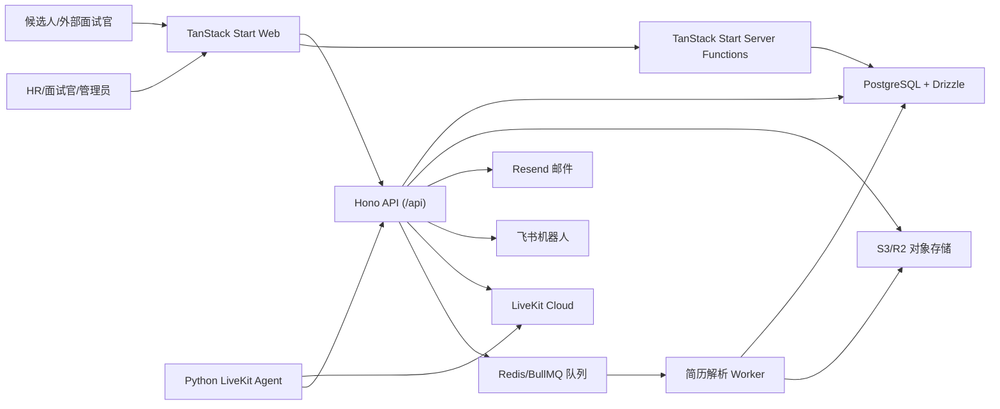

# AI Recruitment Copilot 项目介绍

最后更新：2026-06-10  
资料来源：当前代码结构、`README.md`、`AGENTS.md`、`package.json`、数据库 schema、路由文件、以及 git 提交历史。

## 这是什么项目

AI Recruitment Copilot 是一个面向招聘团队的 AI 面试与简历筛选系统。它不是单一的聊天机器人，也不是单一的视频面试房间，而是把「简历入库、岗位匹配、AI 语音面试、人工面试、评价报告、候选人推进、团队协作」放在同一条招聘流程里。

项目默认中文优先：候选人侧面试提示、AI 面试官指令、后台文案和报告都主要面向中文招聘场景。

从产品角度看，它服务三类核心问题：

1. HR 需要把大量简历快速结构化、筛选、归档，并能追踪每个候选人的当前阶段。
2. 面试官需要复用岗位要求、面试题、候选人资料和历史面试证据，而不是从零准备。
3. 候选人需要通过公开链接完成 AI 面试、表单填写或人工面试，不必进入内部后台。

## 主要用户和使用故事

### HR / 招聘负责人

- 作为 HR，我可以创建工作区、邀请成员、管理部门和成员角色，让不同招聘同学在同一套候选人池中协作。
- 作为 HR，我可以维护在招岗位、岗位说明、面试官、题库、候选人表单和全局面试配置，保证不同轮次的面试口径一致。
- 作为 HR，我可以批量上传简历，系统会解析 PDF、抽取候选人信息、生成简历评价，并把候选人放入简历库。
- 作为 HR，我可以给候选人安排 AI 面试或人工面试，发送邀请链接，并在后台看到状态、报告、录音和时间线。
- 作为 HR，我可以把候选人从 AI 面试推进到人工面试、Offer 或淘汰，并保留过程记录。

### 面试官 / 用人部门

- 作为面试官，我可以查看候选人的简历、岗位匹配信息、AI 面试摘要、证据引用和完整转写。
- 作为面试官，我可以参加人工面试房间，查看面试上下文，减少重复沟通。
- 作为部门负责人，我可以管理本部门面试官和岗位绑定关系，避免候选人被错误分配。

### 候选人

- 作为候选人，我可以打开邀请链接进入 AI 语音面试，按中文对话完成问答。
- 作为候选人，我可以通过公开表单补充必要信息。
- 作为候选人，我可以进入人工面试链接，不需要接触内部管理后台。

### 平台管理员 / 运营

- 作为平台管理员，我可以查看组织、用户、最近活跃等平台级数据。
- 作为运营或集成人员，我可以通过飞书、邮件、LiveKit、对象存储等外部系统把招聘流程连接到实际工作流中。

## 功能版图

### 招聘工作台

入口主要在 `apps/ai-recruitment-copilot/src/routes/w.$slug.studio.*.tsx`。

- 数据看板：展示候选人漏斗、最近活动、岗位分布、Offer 状态等招聘指标。
- 简历库：管理候选人资料、简历 PDF、解析结果、评价摘要、候选人时间线和当前环节。
- AI 面试：管理面试轮次、排期、状态、报告、录音、候选人详情和证据跳转。
- 人工面试：支持人工面试会议、有效期、面试官绑定和 LiveKit 房间能力。
- 在招岗位：维护岗位说明、部门、关联面试官和简历关联。
- 面试官：维护 AI 面试官、音色、所属部门和岗位引用。
- 面试题库：维护可复用题目模板、绑定岗位、归档版本。
- 面试表单：维护候选人侧表单模板、填写记录和岗位作用范围。
- 部门与成员：管理组织结构、工作区成员、邀请链接和成员角色。
- 系统设置：维护公司名称、开场白、结束语、面试规则等全局配置。

### 候选人公开流程

入口包括：

- `interview.$id.tsx` / `interview.$id.$roundId.tsx`：AI 面试页。
- `human-interview.$inviteToken.tsx`：候选人人工面试页。
- `human-interview.interviewer.$inviteToken.tsx`：面试官人工面试页。
- `join.$code.tsx` / `invite.$token.tsx`：加入工作区或接受邀请。
- `r.$roundId.tsx`：公开面试轮次详情。

这些页面的共同原则是：候选人和外部面试官只看到完成当前任务所需的信息，不暴露内部工作台。

### AI 简历与聊天助手

入口包括 `chat.tsx`、`w.$slug.chat.*.tsx` 和后端 `routes/chat`、`routes/resume`。

- 支持上传附件、PDF 解析、视觉/OCR 简历识别、结构化信息抽取。
- 支持围绕简历和岗位进行多轮对话。
- 聊天状态、附件和消息持久化到数据库与对象存储。
- 简历解析可以走同步流式预览，也可以走后台队列处理。

### 语音面试 Agent

代码在 `apps/livekit-agent/`。

- 使用 LiveKit Agents SDK 进入面试房间。
- STT、LLM、TTS、VAD、turn detection 分别由不同 provider / plugin 组合完成。
- 支持候选人断线重连、转写回放、录音、报告回传、超时收尾、候选人长回答保护。
- 这部分用 Python 和 `uv` 管理，和 TypeScript Web/Backend 使用不同包管理器。

### 外部集成

- LiveKit：实时语音房间、AI Agent 参会、录音 egress。
- S3/R2 兼容对象存储：简历、附件、录音。
- Resend + React Email：面试邀请和轮次邮件。
- 飞书：聊天机器人、文件/图片附件、卡片事件和面试通知。
- Better Auth：用户、会话、组织和成员权限基础。

## 当前技术架构



### 为什么是 monorepo

项目有多个运行时：Web、Hono 后端、简历解析 worker、Python 语音 agent、共享 TypeScript 包。monorepo 的好处是：

- 前后端共享类型、Zod schema、数据库 schema，减少「接口改了但另一端不知道」的问题。
- 业务模块能按职责拆分，但仍然在一个仓库里统一检查、测试和发布。
- 对产品同学来说，功能不是散落在多个仓库里，排查一个招聘流程时更容易追踪。

主要目录：

- `apps/ai-recruitment-copilot/`：浏览器 UI、TanStack Start 路由、SSR、server functions。
- `apps/ai-recruitment-copilot-backend/`：Hono API、业务路由、数据库 DAO、外部服务调用。
- `apps/ai-recruitment-copilot-worker/`：后台简历解析 worker。
- `apps/livekit-agent/`：Python 语音面试 agent。
- `packages/db-schema/`：Drizzle schema、relations、数据库相邻类型。
- `packages/shared/`：纯类型、Zod schema、同构工具。
- `packages/adapter-feishu/`：飞书适配层。
- `packages/resume-parse-queue/`：简历解析队列共享定义。

### 前端：TanStack Start + Router + Query

当前 Web 应用已经迁移到 TanStack Start，开发命令是 `vite dev`，构建产物由 Vite/Nitro 生成。它承担页面渲染、路由、部分 server function、SSR/预取和浏览器交互。

选择它的原因不是「换一个更新的框架」，而是项目已经大量使用 TanStack Router、TanStack Query、类型化路由和数据预取。迁移后，路由、搜索参数、loader、server function 和 Query 缓存更容易放在同一套心智模型里。

对不同角色的影响：

- 前端同学：页面主要看 `src/routes`，页面状态优先放在 Router search params 或 Query，而不是手写 URL 字符串。
- 后端同学：纯业务 API 不放在 Web route 里，放到 Hono backend；Web server functions 只处理 Start 运行时相关的胶水逻辑。
- 产品同学：页面切换、列表筛选、返回恢复状态等体验更稳定，尤其是招聘工作台这种表格密集场景。

官方文档：

- TanStack Start: <https://tanstack.com/start/latest/docs/framework/react/overview>
- TanStack Router: <https://tanstack.com/router/latest/docs/framework/react/overview>
- TanStack Query: <https://tanstack.com/query/latest/docs/framework/react/overview>

### 后端：Hono + Drizzle + PostgreSQL

后端核心入口是 `apps/ai-recruitment-copilot-backend/src/server/app.ts`。它通过 `createServerApp()` 创建 Hono app，业务路由统一挂到 `/api` 下。Web 侧的 `src/server.ts` 会把 Hono app 挂进 TanStack Start server entry；同时后端包也可以通过 `src/index.ts` 独立启动。

这意味着当前架构不是「前端一个服务、后端完全另一个服务」的强拆分，也不是「所有 API 都写在前端框架里」。它是一个可嵌入、可独立启动的 Hono 后端包。

为什么这么做：

- 本地开发和默认部署可以保持同源 `/api`，减少 cookie、CORS、回调地址复杂度。
- 后端路由、DAO、外部服务调用有清晰边界，未来要拆成独立服务时有迁移路径。
- Hono 的 RPC 类型可以给前端 JSON API 提供更强的调用约束。

官方文档：

- Hono: <https://hono.dev/docs/>
- Drizzle ORM: <https://orm.drizzle.team/docs/overview>
- PostgreSQL: <https://www.postgresql.org/docs/>

### 认证与组织权限：Better Auth

项目使用 Better Auth 管理用户、session、account、organization、member、invitation 等基础表。业务上不是单用户工具，而是多组织、多成员、多角色的招聘系统。

从代码和历史看，认证方式经历过调整：早期出现过 Google OAuth，之后引入飞书登录和组织限制；当前配置里又保留 Google OAuth 环境变量和 Better Auth 组织能力。新人要注意：认证是产品权限边界的一部分，不只是登录按钮。

官方文档：

- Better Auth: <https://better-auth.com/docs/introduction>

### 实时语音：LiveKit + 独立 Python Agent

语音面试没有放在 Web 进程里，而是由 `apps/livekit-agent/` 里的 Python worker 负责。Web/后端负责创建房间、发起排期、保存报告；agent 负责进入 LiveKit 房间、处理语音对话、录音和结果回传。

这样拆分的原因：

- 语音链路对延迟、VAD、turn detection、断线恢复很敏感，独立 worker 更容易调参和部署。
- Python 生态对 LiveKit Agents、语音 plugin 和 agent 测试更直接。
- Web 后台不需要承担实时音频推理的生命周期。

官方文档：

- LiveKit Agents: <https://docs.livekit.io/agents/>
- LiveKit Web Components / Client: <https://docs.livekit.io/home/client/>

### AI 与文档处理

AI 能力不是一个单点模型调用，而分布在多个业务节点：

- 简历解析：PDF/OCR、结构化抽取、岗位匹配、简历评价。
- AI 面试：根据岗位、题库、候选人资料、全局配置生成面试策略。
- 报告生成：结合转写、题目、候选人回答和证据引用生成评价。
- 聊天助手：围绕简历、岗位、附件进行多轮分析。

代码里可以看到 OpenAI-compatible provider、阿里云/DashScope、Google、ElevenLabs、Minimax、Qwen OCR 等痕迹。文档读者不需要记住所有 provider，重点是：系统刻意把「模型供应商」和「招聘业务流程」分开，便于替换模型而不重写候选人流程。

## 技术选择变迁

下面是从 git 历史和当前代码整理出的主线，不覆盖每个提交，只保留影响团队理解的变化。

### 1. 从原型到可用工作台

早期提交集中在登录、Studio 后台、AI 面试页、聊天和语音 agent。随后增加了部门、面试官、岗位、候选人表单、题库、报告、录音、飞书和对象存储。

这说明项目定位很快从「一次 AI 面试」变成「招聘团队后台」。所以今天看代码时，不要只从候选人面试页入手，也要看后台工作台和候选人生命周期。

### 2. 从页面功能堆叠到可复用后台组件

4 月底有一组 DataGrid 相关提交：列工厂、分页、工具栏、URL 状态、多个 Studio 页面迁移。后续又不断优化表格筛选、排序、密度和可访问性。

这背后的产品原因是：招聘后台大部分核心操作发生在列表中，例如简历库、面试列表、题库、岗位、部门、成员。统一表格不是视觉洁癖，而是降低 HR 重复学习成本。

### 3. 从单组织到多组织/工作区协作

提交历史中可以看到多组织、成员、邀请链接、角色、工作区隔离、slug query key 等变化。数据库里也有 `organization`、`member`、`workspaceInviteLink`、`invitation` 等表。

这意味着新增功能时必须默认考虑 workspace scope。比如列表查询、缓存 key、权限判断、邀请链接、邮件内容，都不能只按用户 ID 判断。

### 4. 从同步简历处理到后台队列

简历解析先支持聊天附件和 OCR，后续增加批量上传、简历库、解析预览、缓存、后台 worker、Redis/BullMQ 队列和 OCR retry。

产品原因很直接：单份简历可以同步等待，多份简历批量上传时必须异步化，否则 HR 会卡在上传页面，也很难处理失败重试。

### 5. 从纯 AI 面试到完整招聘流水线

5 月下旬加入了 pipeline stage、human interview、offer subtables、人工面试会议、候选人 timeline、Offer 状态等能力。

这代表系统不再只输出「AI 面试报告」，而是承载候选人从入库到 Offer 的推进状态。产品讨论时要把 AI 当作流程中的一个节点，而不是整个产品本身。

### 6. 语音 agent 持续围绕真实面试体验调参

Agent 历史里能看到 STT 模型切换、VAD 调整、长回答保护、候选人停顿保护、断线重连、转写回放、录音、软收尾、硬超时、wrap-up task 等多轮修改。

这说明语音面试的难点不只在“能说话”，而在真实候选人会停顿、思考、断线、说很长、被噪音干扰。相关改动需要配测试，不建议只靠手动听一遍判断。

### 7. 从 Next.js 自部署形态迁移到 TanStack Start

历史中有 Next.js standalone、OpenNext/Cloudflare 讨论痕迹，也有 2026-06-09 的迁移提交：迁移到 TanStack Start、移除 oRPC、迁移到 TanStack Router server functions、使用 Vite cache control、React Compiler、DataGrid 状态从 nuqs 迁到 TanStack Router。

当前代码已经是 TanStack Start + Vite，不要再按 Next App Router 的文件约定寻找页面。旧经验仍有参考价值，例如 SSR、server/client 边界、同源 API，但具体实现入口已经变了。

### 8. Hono 后端从 Web 项目中抽成 workspace package

2026-06-07 到 2026-06-08 之间有后端包抽取、DB utilities 移到 backend、resume parse 接收 raw bytes 等提交。当前后端在 `apps/ai-recruitment-copilot-backend/`，并由 Web 的 `src/server.ts` 动态挂载。

这次变化的重点是边界：后端业务代码不应该依赖 Web app 的 `@/` 路径、浏览器模块或 TanStack Start request primitives。这样未来才可能更平滑地独立部署。

### 9. 部分技术尝试被撤回

历史中能看到 Mastra agent state 和 PostHog analytics 的加入与移除。这类记录对新人很重要：不要只看“曾经加过某技术”就认为它是当前方案。当前依赖和代码入口才是准绳。

## 代码导览

### 前端同学优先看

- `apps/ai-recruitment-copilot/src/routes/`：页面和路由 loader。
- `apps/ai-recruitment-copilot/src/components/`：业务组件、DataGrid、布局和 UI 组件。
- `apps/ai-recruitment-copilot/src/lib/client/`：浏览器 API 客户端、Query client、上传/流式工具。
- `apps/ai-recruitment-copilot/src/lib/start/`：TanStack Start server functions。
- `apps/ai-recruitment-copilot/src/router.tsx`：Router 和 TanStack Query SSR 集成。

### 后端同学优先看

- `apps/ai-recruitment-copilot-backend/src/server/app.ts`：Hono app 聚合入口。
- `apps/ai-recruitment-copilot-backend/src/server/routes/`：按业务路由组织的 API。
- `apps/ai-recruitment-copilot-backend/src/lib/server/`：DB、auth、S3、邮件、简历解析等后端能力。
- `packages/db-schema/src/schema.ts`：主数据库表。
- `packages/db-schema/src/relations.ts`：Drizzle relations。

### 语音 agent 同学优先看

- `apps/livekit-agent/src/agent.py`：入口和 LiveKit worker 注册。
- `apps/livekit-agent/src/interview_agent.py`：面试 agent 主要逻辑。
- `apps/livekit-agent/src/prompts.py`：中文面试提示词。
- `apps/livekit-agent/src/ready_check_task.py`、`wrap_up_task.py`：会前检查与收尾任务。
- `apps/livekit-agent/tests/`：agent 行为测试。

### 产品同学优先看

- `apps/ai-recruitment-copilot/src/routes/w.$slug.studio.dashboard.tsx`：招聘数据看板。
- `apps/ai-recruitment-copilot/src/routes/w.$slug.studio.resumes.tsx`：简历库。
- `apps/ai-recruitment-copilot/src/routes/w.$slug.studio.interviews.tsx`：AI 面试列表。
- `apps/ai-recruitment-copilot/src/routes/w.$slug.studio.interviews.$roundId.tsx`：面试详情。
- `packages/db-schema/src/schema.ts`：候选人、轮次、人工面试、Offer、表单、题库等核心业务对象。

产品同学不需要逐行读代码，但可以用这些文件确认一个功能到底是“已经有完整数据模型”，还是只有前端入口。

## 核心数据对象

常见对象和业务含义：

- `organization` / `member`：工作区和成员。
- `workspaceInviteLink` / `invitation`：邀请加入工作区。
- `department`：招聘部门。
- `interviewer`：AI 面试官配置，包括部门和音色。
- `jobDescription`：在招岗位和岗位说明。
- `studioInterview`：候选人主档案/简历库记录。
- `studioInterviewSchedule`：AI 面试轮次或排期。
- `interviewConversation` / `interviewConversationTurn`：面试会话和逐轮转写。
- `studioHumanInterviewRound` / `studioHumanInterviewMeeting`：人工面试轮次和会议。
- `studioOfferDraft`：Offer 阶段信息。
- `candidateFormTemplate` / `candidateFormSubmission`：候选人表单模板和提交。
- `interviewQuestionTemplate`：面试题模板。
- `resumeUploadBatch` / `resumeUploadBatchItem`：批量简历上传任务。
- `studioRoundEmailLog`：轮次邮件发送记录。
- `feishuThreadState`：飞书会话状态。

## 开发协作原则

1. 先确认运行时边界。Web-only 代码放 Web，Hono 业务放 backend，纯共享逻辑放 package，Python 语音逻辑放 agent。
2. 新增后台页面时，优先复用现有 DataGrid、列表筛选、分页和状态同步模式。
3. 新增 API 时，按后端 `routes/<feature>/route.ts + schema.ts + dao/` 的结构就近组织。
4. 新增候选人流程时，先确认它属于公开候选人页面、内部 Studio 页面，还是两边都需要。
5. 涉及工作区数据时，默认需要 slug/org scope、权限判断和 Query key 隔离。
6. 涉及 AI/语音行为时，尽量补测试；提示词、VAD、超时和任务流靠肉眼验证风险很高。
7. 不要根据旧提交或旧文档判断当前架构；以当前 `package.json`、入口文件和路由为准。

## 常用命令

TypeScript 部分使用 pnpm：

```bash
pnpm dev
pnpm check
pnpm --filter @arc/ai-recruitment-copilot typecheck
pnpm --filter @arc/ai-recruitment-copilot-backend typecheck
pnpm --filter @arc/ai-recruitment-copilot test
pnpm --filter @arc/ai-recruitment-copilot-backend test
```

Python agent 使用 uv：

```bash
cd apps/livekit-agent
uv sync
uv run src/agent.py download-files
uv run src/agent.py dev
uv run pytest
uv run ruff check
```

数据库迁移：

```bash
pnpm db:generate
pnpm db:migrate
pnpm db:studio
```

## 新人阅读路线

### 前端

1. 先跑 Web：`pnpm --filter @arc/ai-recruitment-copilot dev`。
2. 看 `src/routes/w.$slug.studio.resumes.tsx` 和 `src/routes/w.$slug.studio.interviews.tsx`，理解列表页模式。
3. 看 `src/router.tsx` 和 `src/lib/client/`，理解 Router + Query + API 调用。
4. 再看具体组件，不要从 UI 基础组件开始读。

### 后端

1. 看 `apps/ai-recruitment-copilot-backend/src/server/app.ts`，理解 `/api` 路由聚合。
2. 选一个模块读通，例如 `studio/routes/resumes` 或 `studio/routes/interviews`。
3. 对照 `packages/db-schema/src/schema.ts` 看数据结构。
4. 再看外部集成，例如 LiveKit、Resend、Feishu、S3。

### 产品

1. 先从招聘流程理解：简历入库 -> 岗位匹配 -> AI 面试 -> 人工面试 -> Offer/淘汰。
2. 再看 Studio 左侧导航对应的模块。
3. 重点关注角色边界：候选人看到公开链接，HR/面试官看到工作台，平台管理员看到平台页。
4. 需求评审时明确影响对象：候选人体验、HR 操作效率、面试官决策质量、后台数据一致性。

## 需要特别注意的历史包袱

- 旧 Next.js/App Router 相关经验可能仍在讨论中出现，但当前页面入口已经是 TanStack Router file routes。
- 旧的 analytics、Mastra 等尝试已经被移除，除非重新评估，否则不要基于这些方向继续扩展。
- 简历解析和 AI 面试都涉及外部模型与存储，失败不是单纯前端错误；排查要看 API、worker、对象存储和 provider 日志。
- 语音面试的“中断、停顿、长回答、断线”都是高频真实场景，产品验收要覆盖这些边界。
- `pnpm` 和 `uv` 不要混用。TypeScript workspace 和 Python agent 是两个依赖系统。
