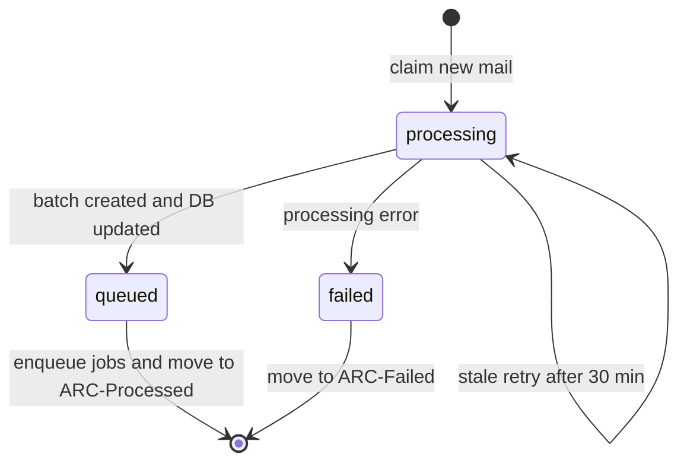

# Boss 直聘简历邮件采集 Implementation Plan

> **Status:** 已实施。本文记录本次设计决策、落地范围、运行语义和后续扩展点，便于后续维护 worker、DB migration 和个人邮箱配置入口。

**Goal:** 支持用户在个人信息页配置自己的阿里企业邮箱。worker 每 15 分钟集中轮询 enabled 邮箱账号，识别标题包含 `boss直聘` 的新邮件，提取简历附件，自动加入该用户的私有简历库解析队列。

**Architecture:** 邮箱账号配置存 DB，不放全局环境变量。后端提供 `/api/w/:slug/studio/mail-ingest-accounts` 配置 API；worker 读取所有 enabled 账号，通过 IMAP 拉取未读 Boss 直聘邮件，把附件上传到 S3，再复用现有 `resume_upload_batch` / `resume_upload_batch_item` 与 BullMQ `resume-parse` 队列。邮件处理记录用 IMAP `uidValidity + uid` 做幂等，并支持 worker 重启后的 `processing` 超时重试。

**Tech Stack:** Hono、Drizzle ORM、PostgreSQL、TanStack Query、BullMQ、IMAPFlow、mailparser、S3/R2 兼容对象存储、Vitest。

---

## Decisions

- 邮箱配置归属到 `organizationId + userId`，因为邮件导入目标是用户自己的私有简历库。
- 密码不存明文，使用 `MAIL_INGEST_SECRET_KEY` 通过 AES-256-GCM 加密。
- 目标固定为 `resume_pool` + `private`，不直接进入正式简历库。
- 默认 IMAP 配置面向阿里企业邮箱：
  - host: `imap.qiye.aliyun.com`
  - port: `993`
  - secure: `true`
- 邮件识别规则先保持简单：未读邮件 + subject 包含配置的 `subjectKeyword`，默认 `boss直聘`。
- 处理后的邮件通过移动文件夹标记：
  - 成功或已完成：`ARC-Processed`
  - 失败：`ARC-Failed`
- 不等待简历 OCR/LLM 解析完成；邮件采集只负责上传附件、创建批次、入队。

---

## File Map

| File                                                                                        | Action | Purpose                                            |
| ------------------------------------------------------------------------------------------- | ------ | -------------------------------------------------- |
| `packages/db-schema/src/schema.ts`                                                          | Modify | 新增邮箱账号表、邮件处理记录表和状态类型           |
| `apps/ai-recruitment-copilot/drizzle/20260617180000_add_mail_ingest_tables/migration.sql`   | Create | 创建 `mail_ingest_account` / `mail_ingest_message` |
| `apps/ai-recruitment-copilot-backend/src/lib/server/mail-ingest-crypto.ts`                  | Create | 邮箱客户端密码加密/解密                            |
| `apps/ai-recruitment-copilot-backend/src/server/routes/studio/routes/mail-ingest/schema.ts` | Create | 配置 API 输入 schema                               |
| `apps/ai-recruitment-copilot-backend/src/server/routes/studio/routes/mail-ingest/dao.ts`    | Create | 配置 CRUD、账号轮询锁、邮件 claim 幂等             |
| `apps/ai-recruitment-copilot-backend/src/server/routes/studio/routes/mail-ingest/route.ts`  | Create | Hono 配置 API                                      |
| `apps/ai-recruitment-copilot-backend/src/server/routes/studio/route.ts`                     | Modify | 挂载 `/mail-ingest-accounts`                       |
| `apps/ai-recruitment-copilot-worker/src/mail-ingest/config.ts`                              | Create | worker env 配置解析                                |
| `apps/ai-recruitment-copilot-worker/src/mail-ingest/message-filter.ts`                      | Create | Boss 直聘 subject 和附件格式筛选                   |
| `apps/ai-recruitment-copilot-worker/src/mail-ingest/processor.ts`                           | Create | IMAP 轮询、附件上传、批次创建、队列入队            |
| `apps/ai-recruitment-copilot-worker/src/mail-ingest/scheduler.ts`                           | Create | 15 分钟调度器                                      |
| `apps/ai-recruitment-copilot-worker/src/index.ts`                                           | Modify | worker 启动/关闭 mail ingest scheduler             |
| `apps/ai-recruitment-copilot-worker/.env.example`                                           | Modify | 新增 mail ingest env                               |
| `apps/ai-recruitment-copilot/src/routes/w.$slug.studio.me.tsx`                              | Modify | 个人页邮箱采集配置入口                             |

---

## Data Model

### `mail_ingest_account`

一行代表一个用户在一个工作区下配置的一个邮箱账号。

Required fields:

- `id`: 邮箱配置 ID。
- `organizationId`: 所属工作区，用于 workspace 隔离。
- `userId`: 所属用户，邮件导入结果进入该用户私有简历库。
- `emailAddress`: 展示用邮箱地址。
- `username`: IMAP 登录账号。
- `encryptedPassword`: 加密后的客户端密码。
- `imapHost`: IMAP host，默认 `imap.qiye.aliyun.com`。
- `imapPort`: IMAP port，默认 `993`。
- `imapSecure`: 是否 TLS，默认 `true`。
- `mailbox`: 轮询文件夹，默认 `INBOX`。
- `processedMailbox`: 成功/已完成后移动到的文件夹，默认 `ARC-Processed`。
- `failedMailbox`: 失败后移动到的文件夹，默认 `ARC-Failed`。
- `subjectKeyword`: subject 匹配关键字，默认 `boss直聘`。
- `target`: 上传批次目标，默认 `resume_pool`。
- `resumePoolScope`: 简历池范围，默认 `private`。
- `jdMode`: 上传批次岗位绑定模式，默认 `none`。
- `jobDescriptionId`: 预留，未来可支持邮箱绑定岗位。
- `dedupPolicy`: 复用批量上传去重策略，默认 `skip`。
- `enabled`: 是否启用轮询。
- `pollingStartedAt`: 账号级轮询锁租约字段。
- `lastCheckedAt`: 最近完成轮询时间。
- `lastError`: 最近账号级错误。
- `createdAt` / `updatedAt`: 审计时间。

Indexes:

- unique `(organization_id, user_id, email_address)`，避免同一用户重复配置同一邮箱。
- `(enabled)`，worker 扫描启用账号。
- `(organization_id, user_id)`，个人页读取当前用户配置。

### `mail_ingest_message`

记录每封邮件的处理状态，用于幂等、重启恢复和排查。

Required fields:

- `id`: 邮件处理记录 ID。
- `accountId`: 对应 `mail_ingest_account.id`。
- `mailbox`: 当时处理的邮箱文件夹。
- `uidValidity`: IMAP mailbox UIDVALIDITY。
- `uid`: IMAP UID。
- `messageId`: 邮件头 Message-ID，辅助排查。
- `subject`: 邮件标题。
- `fromAddress`: 发件人。
- `receivedAt`: 邮件接收时间。
- `status`: `processing | queued | skipped | failed`。
- `batchId`: 成功创建批次后关联 `resume_upload_batch.id`。
- `errorMessage`: 失败原因。
- `processedAt`: 最近处理/claim 时间。
- `createdAt`: 记录创建时间。

Indexes:

- unique `(account_id, mailbox, uid_validity, uid)`，保证同一封 IMAP 邮件只被一个处理流 claim。
- `(account_id, status, created_at)`，便于后续排查和后台列表。
- `(batch_id)`，便于从批次追溯来源邮件。

---

## Polling Lock

账号级锁使用 `mail_ingest_account.polling_started_at`，不是 Redis 锁。

Claim 语义：

```sql
UPDATE mail_ingest_account
SET polling_started_at = now(), last_error = null
WHERE id = :accountId
  AND enabled = true
  AND (
    polling_started_at IS NULL
    OR polling_started_at < now() - interval '14 minutes'
  )
RETURNING id;
```

行为：

- 返回行：当前 worker 获得这个邮箱账号的轮询权。
- 不返回行：另一个 worker 正在轮询，当前 worker 跳过。
- 正常结束：清空 `polling_started_at`，更新 `last_checked_at`。
- worker 崩溃/发布重启：锁不会被清空，14 分钟后过期，后续 worker 可重新 claim。

同一个 worker 内还有内存级 `running` 标记。若 15 分钟 interval 到来但上一轮还没结束，本轮直接跳过，不会在同一进程里并发启动第二轮。

---

## Message State Machine

邮件级状态机解决“worker 插入邮件记录后重启导致永久跳过”的问题。



Existing record handling:

- `queued` / `skipped`: 认为已完成，移动到 `processedMailbox`。
- `failed`: 移动到 `failedMailbox`。
- `processing` 且未超过 30 分钟：跳过，避免并发重复处理。
- `processing` 超过 30 分钟：认为上次 worker 中断，重新 claim 并重试。

入队顺序：

1. 上传附件到 S3。
2. 创建 `resume_upload_batch` 和 `resume_upload_batch_item`。
3. 更新 `mail_ingest_message.status = queued` 并写 `batchId`。
4. 调 `enqueueResumeParseJobs` 入 Redis 队列。
5. 移动邮件到 `ARC-Processed`。

这个顺序的关键点：如果 worker 在第 3 步后、第 4 步前重启，已有 worker startup recovery 会扫描 pending batch item 并重新入队。

---

## Runtime Flow

1. worker 启动时读取 `MAIL_INGEST_ENABLED`。
2. 若未启用，scheduler 不加载 processor，避免关闭功能时触发 DB/IMAP 初始化。
3. 若启用且 `REDIS_URL` 已配置，启动 scheduler。
4. scheduler 默认每 15 分钟执行一次，并在启动后立即跑一轮。
5. worker 查询 enabled 邮箱账号。
6. 对每个账号尝试 claim 账号级锁。
7. 连接 IMAP，打开 `mailbox`。
8. 搜索 `seen = false` 且 subject 命中 `subjectKeyword` 的邮件。
9. 使用 `mailparser` 解析邮件。
10. 使用共享简历格式判断筛选附件。
11. 上传附件到 hash-based S3 key。
12. 复用 `insertBatchWithItems` 创建私有简历池批次。
13. 更新邮件记录为 `queued`。
14. 入 `resume-parse` 队列。
15. 移动邮件到 processed/failed 文件夹。
16. 释放账号级锁。

---

## Environment

worker env:

```env
MAIL_INGEST_ENABLED=true
MAIL_INGEST_SECRET_KEY=stable-random-secret
MAIL_INGEST_INTERVAL_MS=900000
MAIL_INGEST_MAX_ACCOUNTS_PER_RUN=20
MAIL_INGEST_MAX_MESSAGES_PER_ACCOUNT=20
```

Notes:

- `MAIL_INGEST_SECRET_KEY` 必须稳定。更换后已有 `encrypted_password` 无法解密，需要用户重新保存邮箱密码。
- `MAIL_INGEST_ENABLED` 默认 `false`，避免未配置时影响现有 worker。
- `REDIS_URL` 仍然必须配置；邮件采集依赖现有简历解析队列。
- 用户需要在阿里企业邮箱开启 IMAP/SMTP，并使用客户端密码或第三方客户端授权码。

---

## Implemented Tasks

- [x] 新增 `mail_ingest_account` / `mail_ingest_message` schema。
- [x] 新增 migration SQL。
- [x] 新增 AES-GCM 邮箱密码加密工具和测试。
- [x] 新增 Hono 配置 API，并挂载到 studio router。
- [x] 新增个人页邮箱采集配置卡片。
- [x] 新增 worker mail ingest env 解析。
- [x] 新增 subject/附件筛选逻辑和测试。
- [x] 新增 IMAP 轮询、邮件解析、附件上传、批次创建、队列入队。
- [x] 新增账号级轮询锁。
- [x] 新增邮件级 `processing` 状态和 30 分钟超时重试。
- [x] 调整入队顺序，保证发布重启后可由 startup recovery 补队列。

---

## Verification

已执行：

```bash
pnpm check
pnpm --filter @arc/ai-recruitment-copilot typecheck
pnpm --filter @arc/ai-recruitment-copilot-backend typecheck
pnpm --filter @arc/ai-recruitment-copilot-worker typecheck
pnpm --filter @arc/db-schema typecheck
pnpm --filter @arc/ai-recruitment-copilot-worker build
pnpm --filter @arc/ai-recruitment-copilot-worker test -- src/mail-ingest/message-filter.test.ts
pnpm --filter @arc/ai-recruitment-copilot-backend exec vitest run src/lib/server/__tests__/mail-ingest-crypto.test.ts
```

---

## Operational Scenarios

### 同一个 worker 一轮未结束，下一轮 interval 到来

同进程 `running` 标记会让下一轮直接跳过，不会并发处理同一轮。

### 多 worker 部署

账号级 DB 锁保证同一邮箱账号同一时间只被一个 worker claim。若一轮超过 14 分钟，另一个 worker 可能认为账号锁过期并尝试 claim；邮件级唯一索引和 `processing` 状态会继续兜底，避免同一封邮件被重复成功入队。

### worker 处理过程中重启

- 账号级锁会在 14 分钟后过期。
- 已创建批次但未入队的 pending items 会由 worker startup recovery 补入队。
- 已 claim 为 `processing` 但未完成的邮件会在 30 分钟后允许重试。
- 已 `queued` 的邮件再次出现时会移动到 processed，不重复创建批次。

---

## Follow-ups

- [ ] 将账号锁 TTL 改为 env 可配置，或处理每封邮件后 heartbeat 刷新 `polling_started_at`。
- [ ] 增加邮件采集历史列表，展示 queued/failed/skipped 记录和关联批次。
- [ ] 支持一个邮箱绑定一个岗位，让 `jobDescriptionId` 和 `jdMode = bind` 生效。
- [ ] 支持更多招聘平台 subject 规则，例如猎聘、拉勾、前程无忧。
- [ ] 增加 IMAP 连接测试按钮，保存前验证账号密码和文件夹权限。
